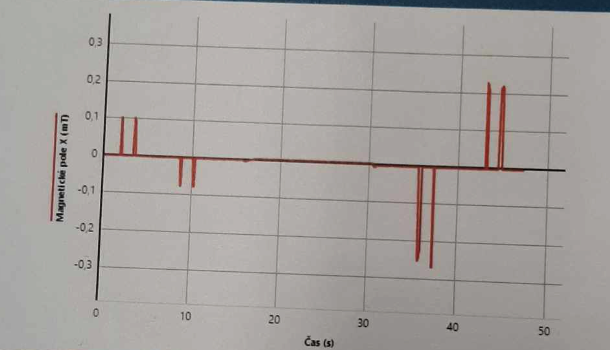

## Kapitoly

#### <a href="https://github.com/scraptechguy/Engineering/blob/main/Physics/Fyzika4.md#">Elektricky naboj a jeho vlastnosti</a>
+ <a href="https://github.com/scraptechguy/Engineering/blob/main/Physics/Fyzika4.md#coulombuv-zakon">Coulombuv zakon</a>
+ <a href="https://github.com/scraptechguy/Engineering/blob/main/Physics/Fyzika4.md#intenzita-elektrickeho-pole">Intenzita elektrickeho pole</a>
+ <a href="https://github.com/scraptechguy/Engineering/blob/main/Physics/Fyzika4.md#prace-v-homogennim-elektrickem-poli">Prace v homogennim elektrickem poli</a>
+ <a href="https://github.com/scraptechguy/Engineering/blob/main/Physics/Fyzika4.md#elektricky-potencial">Elektricky potencial</a>

# Elektricky naboj a jeho vlastnosti

...

## Coulombuv zakon

```
        Q1 * Q2
Fe = k ---------
          r^2
```

... Velikost elektricke sily `Fe` je primo umerna soucinu bodovych naboju `Q1` a `Q2` a neprimo umerna druhe mocnine jejich vzdalenosti

**Konstanta umernosti** `k` je zavisla na prostredi, v nemz na sebe naboje pusobi ...

```
         1
k = ------------
     4pi * etha
```

... kde `etha` je **permitivita prostredi** (pro vakuum je to **8,854e-12 C^2 * N^-1 * m^-2**)

***

Priklady

```
1. Jaka je vzajemna vzdalenost dvou bodovych naboju 10 microC, ktere na sebe pusobi ve vakuu silou 10 N?
```

<details>
<summary>
  Reseni
</summary>

```
        Q1 * Q2
Fe = k ---------
          r^2

r^2 = 
```

</details>

## Intenzita elektrickeho pole

Vektorova velicina charakterizujici elektricke pole ...

```
     Fe
E = ----
     +Q`
```

... intenzita elektrickeho pole je definovana podilem elektricke sily `Fe`, ktera pusobi na kladny bodovy elektricky naboj `Q` v danem miste pole a velikosti toho naboje `Q`

> Smer vektoru intenzity elektrickeho pole `E` je stejny, jako smer vektoru elektricke sily `Fe`

<div align="center">
    

Znazornena intenzita elektrickeho pole
</div>

+ Vzajemne silove pusobeni se uskutecnuje prostrednictvim elektrickeho pole, elektricke pole je v okoli elektricky nabiteho telesa

```
       Q
E = k ---
      r^2
```

... intenzita elektrickeho pole se s rostouci vzdalenosti snizuje

### Modely elektrickych poli

Radialni 
Homogeni

Silocarovy

Vlastnosti silocar elektrickeho pole
```
1. jsou spojite, zacinaji v kladnem naboji a konci v zapornem, pri osamocenem naboji ne pri dvojici naboju se stejnym znamenkem se rozbihaji do nekonecna
2. jsou kolme k povrchu nabiteho telesa
3. navzajem se neprotinaji
```

## Prace v homogennim elektrickem poli

Pri premisteni naboje v homogennim poli elektricka sila kona praci `W` ...

```
Fe = Q * E
W = Fe * (d1 - d2)
W = Q * E * d
```
... kde `Q` je naboj, `E` intenzita elektrickeho pole a `d` vzdalenost bodu od zaporne desky

+ Vykonana prace nezavisi na delce trajektorie, ale na vzdalenosti `d`

### Energie bodoveho naboje v elektrickem poli

Elektricka potencialni energie `Ep` naboje `Q` v urcitem miste elektrickeho pole

```
W = QEd
W = Ep
```

+ Elektricka potencialni energie = prace elektrickych sil

## Elektricky potencial

Castice s elektrickym nabojem v elektrickem poli ma potencialni energii `Ep` ...

... elektricky potencial definujeme jako podil elektricke potencialni energie kladneho elektrickeho naboje `Q` v tomto bode pole a velikosti tohoto naboje ...

```
      Ep
fi = ----
      Q
```

... kde jednotkou elektrickeho potencialu `fi` je `joule / coulomb` neboli **`volt`**

```
fi = E * d
```

+ Mnozina bodu elektricho pole se stejnym elektrickym potencialem se nazyva ekvipotencialni plocha

> Elektricky potencial klesa smerem k zaporne desce

## Elektricke napeti

Aboslutni hodnota rozdilu potencialu mezi dvema body elektrickeho pole je elektricke napeti ...

```
U = |fi2 - fi1|
```

Elektricke napeti mezi kladnou a zapornou deskou je take rovno soucinu intenzity pole a vzdalenosti desek ...

```
U = E * d
```

Prace elektrickych sil pri prenaseni naboje `Q` mezi dvema body, mezi nimiz je napeti `U` ...

```
W = Q * U
```

## Ohmuv zakon pro uzavreny obvod

+ **Vnejsi cast** obvodu tvori rezistory, vodice a spotrebice

+ **Vnitrni cast** obvodu tvori vodivy prostor mezi poly uvnitr zdroje

Energie vydana zdroje se premenuje na energii ve vnejsi a vnitrni casti obvodu ...

```
Ue = U + Ui
```

... soucet napeti na vnejsi a vnitrni casti elektrickeho obvodu se rovna elektromotorickemu napeti zdroje

**Ohmuv zakon pro uzavreny obvod**... 

```
      Ue
I = -------
    R + Ri
```

... proud v uzavrenem obvodu se rovna podilu elektoromtorickeho napeti zdroje a souctu odporu vnejsi a vnitrni casti obvodu

Zatizeny zdroj ...

```
U = Ue - Ri * I
```

... pri zatizenem zdroji je svorkove napeti `U` mensi nez elektromotoricke napeti zdroje `Ue`

Spojeni nakratko (zkrat) ...

```
            Ue
I = Imax = ----
            Ri
```

... pri zkratu je odpor vnejsi casti temer nulovy, proud v obvodu dosahuje nejvetsi moznou hodnotu

## Razeni rezistoru

+ **Seriove razeni rezistoru** - seriove lze radit libovolny pocet rezistoru, celkovy odpor se vypocita jako soucet vsech odporu

+ **Paralelni razeni rezistoru** - pri paralelnim razeni vyjde celkovy odpor mensi nez nejmensi z nich, misto kde se potkava vice vodicu se jmenuje uzel


## Kirchhoffovy zakony

+ **1. Kirchhoffuv zakon** - proudy vstupujici do uzlu maji kladne znamenko, proudy ktere z nej vystupuji maji zaporne znamenko. **Algebraicky soucet proudu v uzlu se rovna nule.**

<div align="center">
    

Prvni kirchhoffuv zakon
</div>

+ **2. Kirchhoffuv zakon** - Soucet ubytku napeti na spotrebicich se v uzavrene casti obvodu (smycce) rovna souctu elektromotorickych napeti zdroju v teto casti obvodu

<div align="center">
    

Druhy kirchhoffuv zakon
</div>

## Elektricka prace a vykon v obvodu s konstantnim proudem

Pri premisteni castic s nabojem `Q` ve vnejsi casti obvodu z jedne svorky zdroje na druhou vykonaji sily elektrickeho pole praci `W` ...

```
W = UIt
```

Prace neelektrickych sil uvnitr zfroje je mirou energie, kterou zdroj doda do obvodu ... 

```
Wz = UeIt
```

Vykon konstantniho proudu ve spotrebici je elektricky prikon spotrebice `P` ...

```
P = W / t = UI
```

Ucinnost zdroje `etha` je tim vetsi, cim vetsi je odpor vnejsi casti obvodu `R` v poronani s vnitrnim odporem droje `Ri` ...

```
          R
etha = --------
       (R + Ri)
```

## Faradayovi zakony

**1. Faradayuv zakon** - Hmotnost latky vyloucene na elektrode zavisi primo umerne na elektrickem proudu, prochazejicim elektrolytem, a na case, po ktery elektricky proud prochazel ...

```
m = A * I * t
```

... kde `m` je hmotnost vyloucene latky a `A` elektrochemicky potencial

**2. Faradayuv zakon** - Latkova mnozstvi vyloucena stejnym nabojem jsou pro vsechny latky chemicky ekvivalentni, neboli elektrochemicky ekvivalent A zavisi primo umerne na molarni hmotnosti latky ...


```
      M
A = -----
    F * z
```

... kde `F` je Faradayova konstanta (**F = 9,6485 * 10^4 C/mol**), a z je pocet elektronu, ktere jsou potreba pri vylouceni jedne molekuly

## Silove pusobeni vodicu s proudy 

Na kazdy vodic pusobi magneticka sila, jsou-li proudy stejneho smeru, vzajemne magneticke silove pusobeni je pritazlive ...

<div align="center">
    

Vodice s proudy stejneho smeru
</div>

... jsou-li proudy odlisneho smeru, vzajemne magneticke silove pusobeni je odpudive

#### Velikost pusobicich magnetickych sil

```
          I1 * I2
Fm1,2 = k -------- l
             d
```

... kde `I1` a `I2` jsou proudy na vodicich, `k` konstanta umernosti a `l` vzdalenost vodicu


#### Magneticka hystereze

Jev, pri kterem se magneticka indukce ve feromagnetickem jadru meni podle popsane krivky

<div align="center">
    

Magneticka hystereze
</div>

## Magneticky indukcni tok

Cim je zavit civky k magnetu bliz, tim je magneticka indukce uprostred zavitu vetsi 

+ **Magneticky indukcni tok** (`fi`) - prochazi plochou `S` kolmou k megnetickym indukcnim caram ...

```
fi = BS
```

... kdyz plocha `S` neni kolma k indukcnim caram, magneticky indukcni tok se rovna ...

```
fi = BS * cos(alpha)
```

... kde `alpha` je uhel mezi normalou plochy zavitu a magnetickymi indukcnimi carami

+ Je-li plocha zavitu kolma k magnetickym indukncnim caram, magneticky indukcni tok plochou zavitu je maximalni

Jedna-li se o civku, celkovy magneticky tok je roven `N` nasobku magnetickeho indukcniho toku plochou jednoho zavitu ...

```
fi = NBS * cos(alpha)
```

### Elektromagneticka indukce

Vznik indukovaneho elektromotoickeho napeti a indukovaneho proudu ve vodici, ktery se nachazi v netacionarnim magnetickem poli, se nazyva elektromagneticka indukce. 

> **Elektromagneticka indukce je jev, ne velicina.** Indukovany znamena vyvolany.

## Faradayuv zakon elektromagneticke indukce

Indukovane elektromotoricke napeti je rovno zaporne casove smene magnetickeho indukniho toku ...

```
        delta fi
Ui = - ----------
        delta t
```

Pri pohybu vodice v magnetickem poli se mezi jeho konci indukuje napeti primo umerne `B`, `l` a `v`, neboli ...

```
Ui = Blv
```

## Obvod stridaveho proudu

#### Zaporny fazovy posun mezi napetim a proudem

```
u = Um * sin(omega * t)
i = Im * sin(omega * t - pi/2)
```

... proud se za napetim opozduje o uhel `pi/2 rad`

#### Induktance

```
      Um
Xl = ----- = omega * L
      Im
```

... jednotka induktance je stejna jako jednotka odporu

> **Induktance** = zdanlivy odpor 

## Obvod stridaveho proudu s kondenzatorem

> vlastnost ktera charakterizuje kondenzator je kapacita `C`

#### Kondenzator

Kondenzator v obvodu stridaveho proudu se periodicky nabiji a vybiji, nabijeci proud je nejvetsi v okamziku, kdyz je kondenzator nenabit - bez napeti

V okamziku, kdyz je konenzator nabity na napeti `Um`, je proud v obvodu nulovy

#### Kladny fazovy posun mezi napetim a proudem

```
u = Um * sin(omega * t)
i = Im * sin(omega * t + pi/2)
```

... proud napeti predbiha o uhel `pi/2 rad`

#### Kapacitance

```
      Um          1
Xc = ----- = -----------
      Im      omega * C
```

... jednotka kapacitance je stejna jako jednotka odporu, jedna se take o zdanlivy odpor

## Laboratorni prace

+ **Magneticke pole vyvolane elektrickym proudem** - pruchodem elektrickeho proudu vzniklo v okoli vodice magneticke pole, orientace pole zavisi na smeru proudu, magneticke pole lze zesilit vyuzitim stoceneho vodice (civky)



### Elektrolyza

+ **Elektrolyza NaCl** - chlor (Cl2) vznika na kladne elektrode, vodik (H2) na zaporne elektrode. V elektrolytu zbyva hydroxid sodny

<div align="center">
    
</div>

+ **Elektrolyza H2O** - vodik (H+) vznika na zaporne elektrode, kyslik (O-) vznika na kladne elektrode

<div align="center">
    
</div>

+ **Zelezo v roztoku modre skalice** - z roztoku modre skalice se vyredukovala med a ta se uchytila na zeleznem predmetu

## Vykon stridaveho proudu v obvodu s odporem

```
P = UI * cos fi
```

537 311 170
ne 311
8.5 kV

0.91
24.6
9
12.5

### Trojfazovy alternator

soucet okamzitych hodnot stridavych napeti indukovanych v civkach je stale nulovy

```
----------------------- L1
----------------------- L2
----------------------- L3
----------------------- N
```

+ **Fazove napeti** - napeti mezi fazovymi vodici (`L1 - L3`) a nulovacim vodicem (`N`)

Elektromotor DU

+ **Transformator** - zarizeni, jimz se premenuji stridave proudy a napeti na jine hodnoty napeti a proudu se stejnou frekvenci, maji ucinnost 90 az 98 procent

Energie elektrickeho pole nabiteho kondenzatoru se meni na energii magnetickeho pole civky


rad interferenc

b sin(alpha) = 2k * lambda/2

10.6 21.5 33.4

delta fi = 2pi/lambda * d

